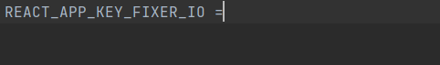
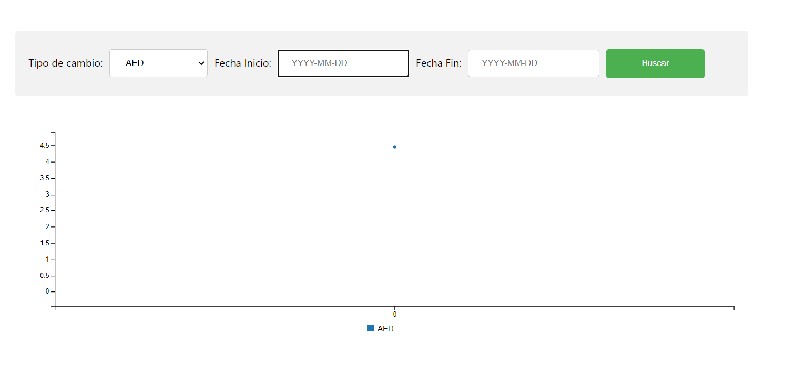

# Inicio

###Requisitos
 1.Contar con nodejs instalado.
 ### `node -v`
##Resumen
Este proyecto muestra el historico de precios de moneda del peso respecto a otras divisas dado una fecha de inicio y una fecha fin.
##Descarga
Para inciar el proyecto descargalo desde la terminal de tu maquina, con el comando:
 
### `git clone https://github.com/`

##Inicializar Proyecto
Ingresa a la carpeta root del projecto desde la terminal y ejecuta el siguiente comando para descargar los modulos necesarios para que el projecto funcione adecuadamente:

### `npm install`

Desplige del app de mandera local:

## Key fixer.io

Para poder utilizar este proyecto deberas registrarte en http://fixer.io

##Ingresar Key
Ingresa a la carpeta root de proyecto y abre el archivo **`.env`**

Copia y pega tu key

##Despliegue

### `npm Start`

Una vez iniciada la aplicación podras acceder a ella desde tu navegador en la dirección
[http://localhost:3000](http://localhost:3000)

### APP

